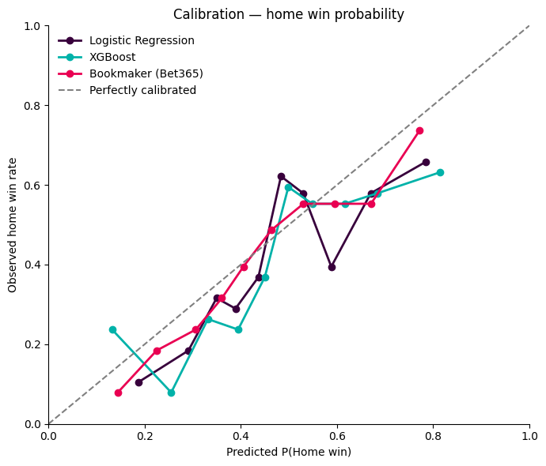
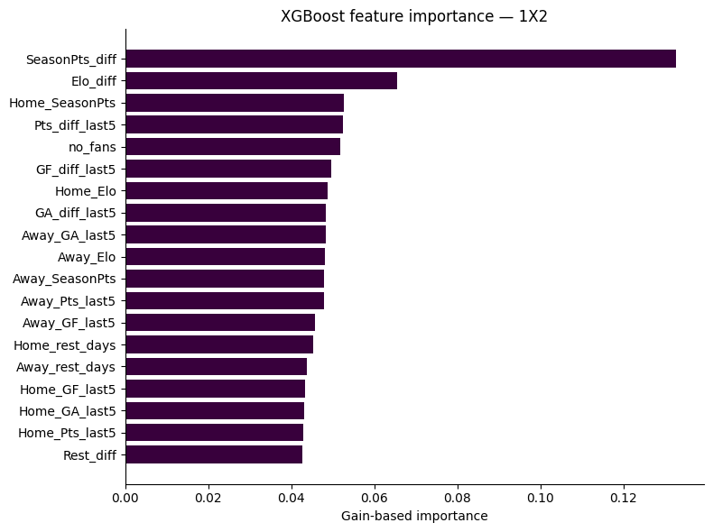
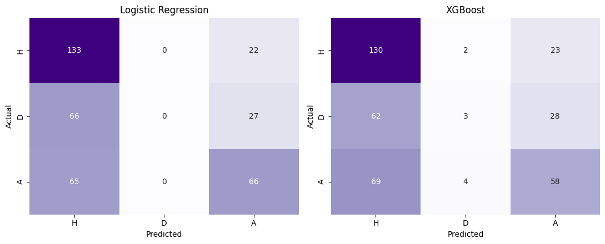
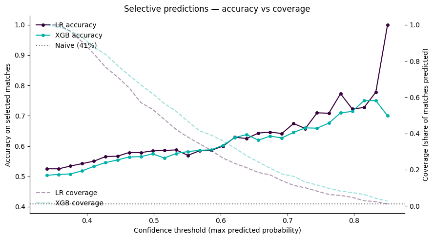

# ⚽ Premier League Match Prediction

Predicting match outcomes (1X2), Over 2.5 goals, and Both Teams to Score from
pre-match features across ten Premier League seasons — with an honest
accounting of what worked, what didn't, and why.

## Headline result

| Model | 2024/25 Accuracy | 2025/26 Accuracy | Drop |
|---|---|---|---|
| Naive (always home win) | 40.9% | 42.2% | +1.3 pp |
| Logistic Regression | 52.5% | 46.7% | **-5.8 pp** |
| **XGBoost** | 50.4% | 48.9% | **-1.5 pp** |
| Bookmaker (Bet365) | 53.8% | 49.7% | -4.1 pp |

Logistic Regression scores higher in-sample, but **XGBoost generalizes
better** — its accuracy barely moves on an untouched future season, while
Logistic Regression's drops nearly 6 points. On a genuine out-of-sample test,
XGBoost is the more trustworthy model despite the lower headline number.



## What this project covers

- **1X2** (home win / draw / away win) — 3-class classification
- **Over 2.5 goals** — binary
- **Both Teams to Score (BTTS)** — binary

Nineteen pre-match features (form differentials, Elo, rest days, season
progress, COVID-era no-fans indicator) engineered with strict `.shift(1)`
leakage prevention, trained on 2015/16–2023/24, tested on two independent
seasons the model never saw during training or tuning.

## The negative result — and why it's a finding, not a failure

Over 2.5 goals and BTTS **did not beat the naive baseline** on either test
season. AUCs sit at ~0.50 — essentially random ranking.

This isn't a modeling bug. The features describe **strength asymmetry**
(who's better) — which predicts *who wins*, not *how many goals get scored*.
Goal-count markets depend on each team's attack/defence profile separately,
a signal these features don't capture. Same pipeline, same data, different
target — and the signal vanishes. That's a feature-design finding: strength
differentials predict winners, not goal counts.

## Model comparison & error analysis




Both models struggle most with draws — the hardest class in football
prediction, consistent with published literature. Restricting predictions to
the most confident third of matches raises accuracy to ~60%, illustrating a
real coverage/accuracy tradeoff relevant to any downstream betting or
decision use.



## Repo structure

```
notebooks/
├── premier_league_prediction.ipynb   # full analysis: EDA → features → models → evaluation
└── build_features.ipynb              # standalone feature pipeline (raw data → games_with_features.csv)
data/
└── games_with_features.csv           # pre-engineered features, ready to load — no pipeline run required
assets/                                 # charts referenced in this README
```

`premier_league_prediction.ipynb` loads `data/games_with_features.csv` directly and runs standalone.
`build_features.ipynb` is included to show how that file was produced from raw match data — run it only if you want to regenerate the features from scratch.

## Methodology

- **Time-based split** (non-negotiable): train 2015/16–2023/24, test
  2024/25, cross-season hold-out 2025/26 — no random splits, no future
  leakage
- **Two models chosen to bracket model complexity**: Logistic Regression
  (linear, interpretable coefficients) vs. XGBoost (non-linear, built-in
  regularization) — so agreement/disagreement between them is informative
  about the *features*, not just the algorithm
- **Baselines on both ends**: naive majority-class defines the floor,
  bookmaker closing odds define a realistic ceiling
- Full methodology, feature list, and limitations discussion in the notebook

## Limitations

- No player-level data (injuries, lineups, transfers) — a known ceiling on
  achievable accuracy without this
- No xG (expected goals) — would likely help the goal-count markets most
- Referee identity shows a weak home-advantage correlation, but most of it
  disappears once team quality is controlled for — investigated and ruled
  out as a useful feature, documented in the notebook

## Data source

10 seasons of match results and closing odds from
[football-data.co.uk](https://www.football-data.co.uk/), a free public
football statistics mirror.
